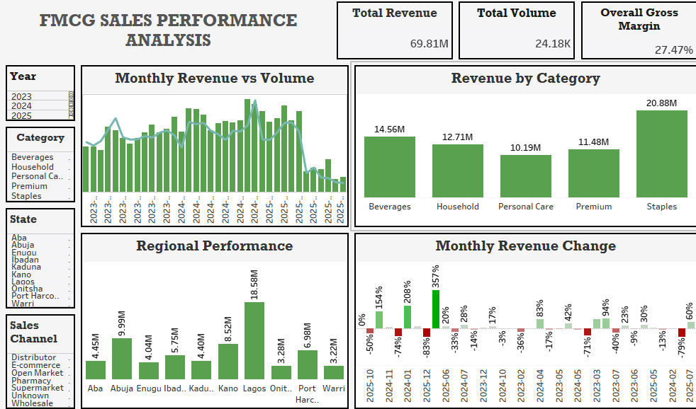
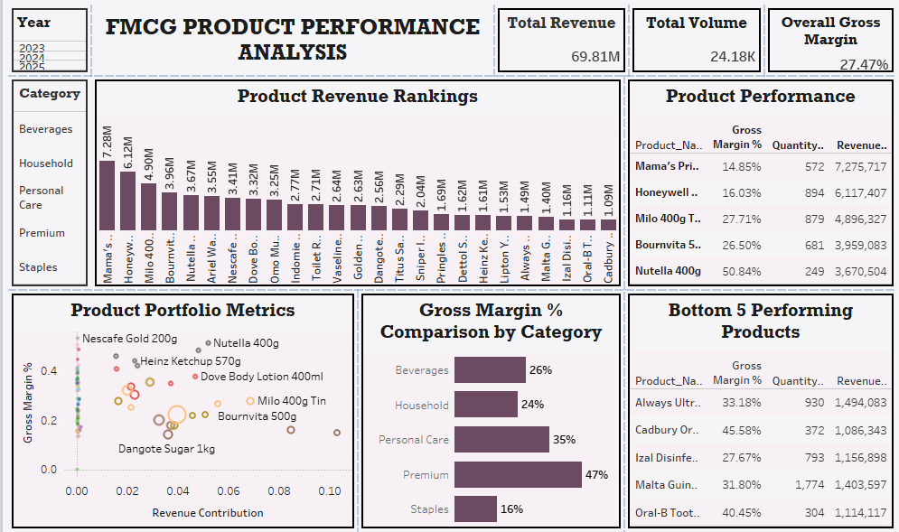

# FMCG Sales & Product Performance Analysis

## Project Overview

This project presents an interactive Tableau dashboard designed to analyze the sales and product performance of a Fast-Moving Consumer Goods (FMCG) company. The analysis covers sales trends, product performance, regional performance, customer purchasing patterns, and profitability between 2023 and 2025.

The goal of this project is to transform raw sales data into meaningful business insights that support strategic decision-making.

---

## Business Problem

The company needed to answer the following business questions:

- Which product categories generate the highest revenue?
- Which products contribute the most to sales?
- Which regions and states perform best?
- How has revenue changed over time?
- Which products are driving profitability?
- How can the business improve overall sales performance?

---

## Objectives

- Analyze overall sales performance.
- Evaluate product category performance.
- Identify top-performing regions and states.
- Track monthly revenue trends.
- Measure gross margin and profitability.
- Build an interactive dashboard to support business decisions.

---

## Tools Used

- **Python** – Data cleaning and analysis
- **Microsoft Excel** – Data preparation
- **Tableau** – Dashboard development and visualization

---

## Dashboard 1: Sales Performance

### Key Metrics

- Total Revenue
- Total Sales Volume
- Overall Gross Margin

### Visualizations

- Monthly Revenue vs Volume
- Revenue by Category
- Regional Performance
- Monthly Revenue Change

### Interactive Filters

- Year
- Category
- State
- Sales Channel

---

## Dashboard 2: Product Performance

### Key Metrics

- Product Revenue
- Product Profitability
- Product Sales Performance

### Visualizations

- Product Category Analysis
- Top Performing Products
- Product Revenue Distribution
- Product Performance Trends

### Interactive Filters

- Year
- Product Category
- Region
- Sales Channel

---

# Key Insights

### Revenue Performance

- Staples generated the highest revenue among all product categories.
- Personal Care generated the lowest revenue, presenting an opportunity for growth.

### Regional Performance

- Lagos recorded the highest sales revenue.
- Some states consistently underperformed, indicating opportunities for market expansion.

### Sales Trends

- Monthly revenue fluctuated throughout the reporting period, suggesting seasonal demand patterns.

### Profitability

- The company maintained a healthy gross margin of **27.47%**, indicating profitable operations.

### Product Performance

- High-performing products contributed significantly to overall revenue, while several low-performing products may require pricing or marketing improvements.

---

# Business Recommendations

- Increase investment in high-performing product categories.
- Improve marketing strategies for underperforming products.
- Replicate successful sales strategies from top-performing regions.
- Monitor monthly revenue trends to improve demand forecasting.
- Optimize inventory management based on product demand.

---

## Skills Demonstrated

- Data Cleaning
- SQL Querying
- Business Intelligence
- Dashboard Design
- KPI Reporting
- Sales Analytics
- Product Performance Analysis
- Trend Analysis
- Interactive Dashboard Development
- Data Visualization

---

## Repository Contents

```
FMCG-Sales-and-Product-Performance-Analysis
│
├── README.md
├── FMCG Sales Dashboard.png
├── FMCG Product Performance Dashboard.png
├── Tableau Workbook.twbx
├── SQL Queries.sql
├── Dataset.xlsx
```

---

## Dashboard Preview

### Dashboard 1 – Sales Performance



### Dashboard 2 – Product Performance



---

## About Me

I am an aspiring Data Analyst with a passion for transforming raw data into actionable business insights. I enjoy building interactive dashboards, analyzing business performance, and solving real-world problems using SQL, Excel, Power BI, and Tableau.

Feel free to explore this project and share your feedback!
